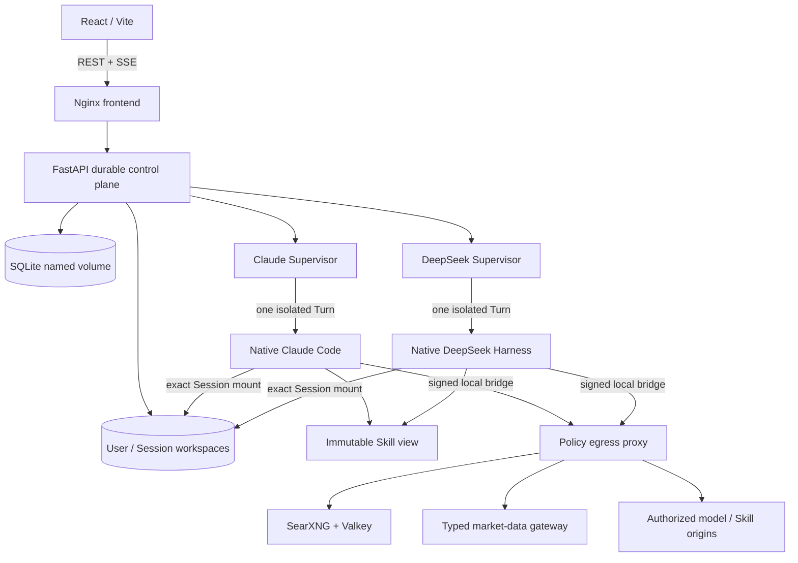

# ChatDS

ChatDS 是一个面向多用户、长时运行 Agent 和可移植 Skills 的 Web 执行平台。它把
React 会话界面、FastAPI 持久控制面、原生 Claude Code、原生 DeepSeek Harness、
Session 级隔离工作区、受控网络出口和可审计的工作流/产物收据组合在一起。

> 项目状态：研究与内部工程软件。当前部署目标为 Linux + Docker Compose。
> 代码包含较完整的确定性测试和生产 E2E 验证，但尚未经过独立安全审计；不要未经
> 额外加固就直接暴露给不受信任的公网用户。

## 核心原则

- **原生引擎闭环**：Claude Code 与 DeepSeek Harness 各自拥有 planning、工具循环、
  子 Agent、上下文压缩、Provider retry 和原生 Session 行为。ChatDS 不复制第二套
  Agent loop，也不修改两个上游 Harness 的核心流程。
- **一个用户 / Session，一个工作区**：每个 Turn 只挂载当前用户、当前 Session 的
  workspace；不能读取其他用户或其他 Session 的内容。
- **通用 Skill 执行**：Skill 的指令、资源、worker、route、能力、证据与产物合同被
  编译成不可变运行视图。生产策略不针对某个疾病、报告名、文件数、Session ID 或
  测试包写特判。
- **机器收据优先**：模型文字是内容，不是控制状态。mandatory worker、工具结果、
  workflow frontier、artifact 校验和唯一 terminal 都以持久化机器收据为准。
- **浏览器只是观察者**：SSE 断开、刷新或关闭页面不会自动终止后台任务；页面通过
  durable AgentRun、消息与活动投影恢复状态。
- **最小边界适配**：ChatDS 只拥有 Web/user/Session 边界、单 workspace mount、
  provider/model 协议绑定、附件与 Skill/MCP 投影、权限、SSE、持久化、取消清理和
  部署安全策略。

旧版 ChatDS Legacy Harness 已从新执行入口和生产拓扑中退役。历史数据库兼容字段与
迁移代码仍可能保留 `legacy` 名称，但它们不是可选择的执行引擎，也不能作为 fallback。

## 功能概览

- 多用户认证、Conversation 管理和 Session fork。
- Claude Code 与 DeepSeek Harness 两个平级原生执行引擎。
- `read_only`、`workspace_write`（写入逐次 Allow/Reject）和 `session_full` 三档权限。
- 每个用户/Session 独立的持久 workspace、附件、预览、下载与 artifact 索引。
- 原生多 Agent/worker 执行、阶段屏障、失败隔离、fan-in 和唯一终态。
- ZIP Skill 安装、依赖/资源闭包、不可变 Skill view 与通用 workflow compiler。
- 结构化 capability authority、mandatory receipts、evidence gate 和 artifact contract。
- 持久 AgentRun、子任务、工具生命周期、debug ledger、Token 与终态记录。
- 后台长任务、断线重连、取消/清理与前端 durable reconciliation。
- 通过本机 SearXNG 的 Web search，以及受控 market-data、MCP 和 schedule 能力。
- 签名、限额、精确 origin/path/method 的网络出口策略。
- 文本与 reasoning 流压缩展示；同一工具调用在原卡片内从“执行中”更新为完成/失败。

## 架构



一次复杂 Skill Turn 的单调执行顺序为：

```text
compile/bind
  -> decide conditional authority
  -> satisfy mandatory receipts
  -> optional retrieval
  -> synthesize/fan-in
  -> validate artifacts
  -> persist exactly one authoritative terminal
```

有界恢复必须停留在当前 mandatory frontier；不得因为模型自述“已完成”而跳到后续阶段。

## 原生引擎边界

### Claude Code

- Runner 镜像安装固定版本的原生 Claude Code CLI。
- ChatDS adapter 使用原生 structured I/O、permission prompt、工具事件和 result 语义。
- Claude Code 自己负责 Agent/tool loop、子 Agent、compaction 和 Provider retry。
- 每个动态 Turn 容器只获得一个 Session workspace、不可变 Skill view 和必要的控制 socket。
- ChatDS 不 patch、fork 或替换 Claude Code binary/core。

### DeepSeek Harness

- `deepseek-harness-clean/` 是只读 vendored snapshot，固定到经过验证的上游提交。
- Runner 按上游源码构建并调用原生 CLI/Session/event/tool/permission 流程。
- ChatDS adapter 只完成 provider binding、workspace/Skill projection、事件持久化与 Web DTO 投影。
- 原生工具权限保持 exact tool identity，不通过粗粒度 plugin group 扩权。
- ChatDS 不修改 DeepSeek Harness 的 planning、工具循环和 multi-agent 核心。

## Skill 执行模型

Skill 以 ZIP 上传，包内至少包含一个规范的 `SKILL.md`，也可以包含：

- 被 `SKILL.md` 引用的说明与资源；
- scripts、templates 和静态 assets；
- primary/supporting Skill bundle；
- worker/agent 声明与有序或并行 workflow route；
- runtime、MCP、网络和 capability 声明；
- evidence 与 output/artifact contract。

每次运行时，Backend 会冻结当前用户/Session 可见的包和资源摘要，生成内容寻址的
Skill view，并把声明编译为两个原生引擎都可消费的边界数据。通用执行器只解释包中
声明的值，不把某个测试用例的 route、worker 数、文件名或业务词汇写进 Harness 策略。

复杂 Skill 的成功至少要求：

1. 所有当前阶段 mandatory worker 都有可信终态；
2. phase barrier 与条件 authority 没有被绕过；
3. 必需工具/证据有机器收据；
4. 最终文件来自合法 synthesis/fan-in 阶段；
5. artifact contract 对路径、大小、行数、结构等检查通过；
6. 持久层只有一个权威 terminal。

业务级 ground truth 用于结构、覆盖度和质量验收，不要求随机模型生成文本逐字相同。
若产品需要 byte-identical 输出，应另外设计确定性模板产品，而不是把它伪装成通用
Skill 指令遵循。

## Session 隔离与安全模型

- Backend 从已认证 user ID 与 Conversation ID 推导 workspace；拒绝路径穿越、危险
  symlink、特殊文件、不安全归档成员和跨 Session 路径。
- 动态 Claude/DeepSeek Turn 使用 `network_mode: none`、只读 runtime、受限 capability、
  PID/CPU/内存限制，并且不挂载 Docker socket。
- 只有可信 Supervisor 拥有 Docker lifecycle 权限；Supervisor 不执行模型生成的命令。
- 网络访问通过本地 socket bridge 进入签名 egress proxy。私网目标必须同时满足
  deployment allowlist、当前 Turn authority 和地址/CIDR 校验。
- Web search 可绑定到部署自有 SearXNG；模型不会因此获得任意宿主网络访问。
- Workspace mutation lock 位于宿主本地 Docker volume，不依赖 NFS 文件锁。
- 附件、Skill view、artifact 和关键 controller receipt 均使用内容摘要或稳定 identity。

这些控制降低风险，但不等于数学意义上的零泄漏。URL、查询参数、DNS 或已经授权的
Provider 请求本身仍可能携带信息；部署主机、模型供应商与允许的 MCP/网络端点仍属于
信任边界。

不要把密钥写入 Session workspace、Skill ZIP、prompt、生成脚本或 Git。Provider key
只能保存在权限受限的 `.env`/`.local_secrets` 或外部 secret manager 中。

## 环境要求

- Linux x86-64，近期版本 Docker Engine 与 Docker Compose plugin；
- Git；
- Python 3.12+ 和 Node.js 20+（仅宿主开发/测试需要）；
- 首次构建镜像时可访问固定的基础镜像、Python/npm 依赖和上游包；
- 至少一个与所选引擎协议兼容的模型 Provider；
- 足够的磁盘、内存和 NFS/本地存储空间。

默认并发和资源上限面向长时复杂任务，不适合小内存机器。请根据硬件降低两个 Runner
的并发、CPU 和内存限制。

## 快速启动

### 1. 克隆与初始化

```bash
git clone https://github.com/feng4251/chat_ds.git
cd chat_ds
cp .env.example .env
mkdir -p data harness/data/memories /nfs/temp/chat_ds
chmod 700 data harness/data/memories /nfs/temp/chat_ds
chmod 600 .env
```

当前 Compose 把 Session workspace 根固定在 `/nfs/temp/chat_ds`，以便可信 Supervisor
创建的动态容器使用同一绝对宿主路径。若部署环境必须使用其他位置，应一致修改 Backend、
两个 Supervisor 和 mount 定义，并运行 workspace/isolation contract tests；不要只改单个
服务的路径。

### 2. 配置 secrets 与 Provider

编辑 `.env`，至少替换以下值：

```dotenv
CHATDS_DATA_ROOT=/absolute/path/to/chat_ds/data
CHATDS_MEMORY_ROOT=/absolute/path/to/chat_ds/harness/data/memories
SECRET_KEY=replace-with-a-random-value
INTERNAL_API_TOKEN=replace-with-an-independent-random-value
EXECUTOR_V2_AUTH_TOKEN=replace-with-another-independent-random-value
SEARXNG_SECRET=replace-with-a-random-value

SHAIENGINE_BASE_URL=https://your-provider.example/v1
SHAIENGINE_API_KEY=replace-with-your-provider-key
```

不要复用 JWT、内部控制面、egress policy 与 SearXNG secret。Provider profile、模型名和
wire protocol 必须同时匹配：Claude Code 通过 Anthropic Messages-compatible surface
运行；DeepSeek Harness 使用其原生 OpenAI-compatible provider binding。部署可以为同一
供应商分别暴露这两个兼容面。

如需启用 DeepSeek Harness，在 `.env` 中设置：

```dotenv
DEEPSEEK_HARNESS_ENGINE_ENABLED=true
```

私网模型端点还必须加入精确 origin 与 CIDR allowlist。模型出现在 UI catalog 中，并不
自动授予网络访问权。

### 3. 构建并启动双引擎

```bash
docker compose \
  --profile claude-code \
  --profile deepseek-harness \
  --profile local-search \
  up -d --build

docker compose ps
curl --fail http://127.0.0.1:5173/api/health
```

打开 <http://127.0.0.1:5173>，注册用户并创建 Conversation。执行引擎是 Conversation
不变量；已有消息后如需切换引擎，应通过 Session fork，而不是拼接两种不兼容的原生
transcript/checkpoint。

### 4. 停止但保留数据

```bash
docker compose \
  --profile claude-code \
  --profile deepseek-harness \
  --profile local-search \
  down
```

不要附加 `-v`，除非确实要删除数据库、Runner state、搜索状态、proxy trust 和 lock plane。

## Compose 组件

| 组件 | 作用 |
|---|---|
| `frontend` | React SPA、Nginx、REST/SSE 反向代理 |
| `backend` | 认证、Conversation、持久 run、Skill、文件、artifact、schedule |
| `claude-runner-supervisor` | Claude Turn admission、容器生命周期、ledger 与终态 |
| `claude-runner-image` | 固定动态 Claude Code Turn 镜像的 inert anchor |
| `deepseek-runner-supervisor` | DeepSeek Turn admission、原生 event relay 与终态 |
| `deepseek-harness-runner-image` | 固定动态 DeepSeek Harness Turn 镜像的 inert anchor |
| `native-session-runtime-image` | 两个原生 Runner 共用的只读依赖底座；不含 Agent loop |
| `skill-egress-proxy` | 签名 destination/method/TLS/budget 策略与收据 |
| `searxng` / `searxng-valkey` | 本地受控 Web search |
| `market-data-gateway` | 固定上游、类型化、只读行情接口 |

## 权限档位

前端为两个原生引擎提供一致的三档 Session 权限入口：

| 档位 | 行为 |
|---|---|
| `read_only` | 只读当前 Session workspace，不允许写入 |
| `workspace_write` | 可以请求写入，但每次按原生 permission relay Allow/Reject |
| `session_full` | 在当前 Session 容器边界内授予完整原生工具权限 |

`session_full` 仍不等于宿主权限：它不会挂载其他 workspace、Docker socket 或 ambient
network，也不会绕过签名 egress policy。

## 开发与测试

典型的确定性验证命令：

```bash
PYTHONPATH=backend python -m pytest -q backend/tests

PYTHONPATH=.:backend python -m unittest discover -v -s claude_runner/tests

node --test deepseek_runner/tests/*.test.mjs

cd frontend
npm ci
npm test
npm run build
cd ..

python -m compileall -q backend claude_runner deepseek_runner \
  native_security skill_egress_proxy market_data_gateway
git diff --check
```

部分 Docker lifecycle、镜像自检、namespace、seccomp 和真实浏览器测试要求 Linux、
Docker、已构建镜像或额外宿主能力。

复杂 Skill 暴露缺陷时，先把问题表述为跨领域的 compiler、workflow、capability、
sandbox、evidence、artifact、recovery 或 lifecycle 不变量，再添加 synthetic regression
和 rename/cross-domain holdout。复杂业务 E2E 是验收测试，不能成为证明通用性的唯一测试。

## 最近验证基线

当前 `main` 候选版本已经完成：

- Backend 全量测试：394 passed；
- Claude Runner 全量测试：125 passed，1 skipped；
- Frontend 全量测试：59 passed，并通过 production Vite build；
- Claude Code 与 DeepSeek Harness 各一次同输入、同不可变 Skill view 的复杂双阶段 E2E；
- 两次 E2E 的 declared workers、workflow contract、artifact contract 与唯一 terminal 均通过；
- GLM-5.3 的 Claude Code 与 DeepSeek Harness 低成本生产 smoke 均成功；
- Backend、Frontend、两个 Supervisor、SearXNG 与 egress proxy 的生产健康检查通过。

E2E 输出是业务验收样本，不会被写成生产 fixture 特判，也不会在普通测试命令中自动
重复调用昂贵模型。

## 运维

```bash
docker compose ps
docker compose logs -f frontend backend \
  claude-runner-supervisor deepseek-runner-supervisor
curl --fail http://127.0.0.1:5173/api/health
```

升级建议：

1. 停止接受新任务，等待 active AgentRun、schedule 与动态 Turn 进入终态；
2. 使用 SQLite online backup 或在 Backend 停止后备份 named volume；
3. 从 clean Git archive 构建不可变 candidate images；
4. 执行迁移、测试、image self-test、健康检查和低成本受控 Conversation；
5. 保留上一组 image tag 与数据库备份，直到新 cohort 稳定。

不要把 `docker compose down -v`、广泛 image prune 或 workspace 删除当作普通升级步骤。

## 排障证据链

诊断一个 Session 时必须同时对齐：

1. 持久化 Conversation/messages 与用户原始请求；
2. exact immutable Skill package/view/instructions/resources；
3. debug、AgentRun、native event、tool、workflow、artifact 与 terminal receipts。

前端的一句错误文案不足以判断根因。应分别归类 Harness adapter、Skill 声明、Provider/
模型、网络策略、上游可用性和 Web projection，并只修改通用根因。Provider 401/5xx、
网络 reset、mandatory worker 缺失、artifact 不合格和 UI 生命周期错误应保持各自因果，
不能被一个泛化的 `workflow_contract_failed` 遮蔽。

## 仓库结构

```text
backend/                 FastAPI、数据库、engine adapters、Skill/control plane
frontend/                React/Vite UI 与 Nginx 配置
claude_runner/           Claude Code Turn/Supervisor 边界适配与测试
deepseek_runner/         DeepSeek Harness Turn/Supervisor 边界适配与测试
claude-code/             固定 Claude Code 成熟实现参考快照（只读）
deepseek-harness/        保留的 DeepSeek Harness 上游快照（只读）
deepseek-harness-clean/  生产构建使用的固定 DeepSeek Harness 快照（只读）
hermes-agent/            保留的第三方参考快照（非当前 Harness 设计依据）
native_security/         两个原生 Runner 共用的安全边界
executor/                中性 session runtime 构建底座
skill_egress_proxy/      签名 HTTP(S) policy proxy 与 budget ledger
market_data_gateway/     类型化固定上游行情 broker
searxng/                 本地 SearXNG 配置
docker-compose.yml       完整部署拓扑与 profiles
SESSION_HANDOFF.md       当前仓库的权威维护交接状态
```

Runtime 数据、用户上传 Skills、生成 artifacts、密钥和未声明的本地参考副本不应提交到 Git。

## 贡献约束

提交修复时请包含：

- 最小、确定性复现；
- 明确的组件和可观察故障边界；
- 通用不变量测试，以及适用时的跨领域/重命名 holdout；
- 无凭据、用户 Session 数据、生成业务产物或未授权第三方源码进入提交的确认；
- 对持久状态变更的迁移与回滚说明。

Skill 显式声明的值可以作为数据编译与执行，但不能升级为写死在 Harness 中的业务策略。

## License

ChatDS 原创贡献使用 [PolyForm Noncommercial License 1.0.0](LICENSE)。这是
source-available 的非商业许可证，不是 OSI 批准的开源许可证。

第三方依赖、容器镜像、模型 runtime、上传 Skills、数据集和生成内容适用各自条款。
详见 [THIRD_PARTY_NOTICES.md](THIRD_PARTY_NOTICES.md)。

## 免责声明

ChatDS 可能生成医疗、法规、金融或其他高影响内容。输出可能不完整或错误，不构成专业
建议。使用者必须在依赖结果前完成人工审查、来源核验、合规与授权检查。
