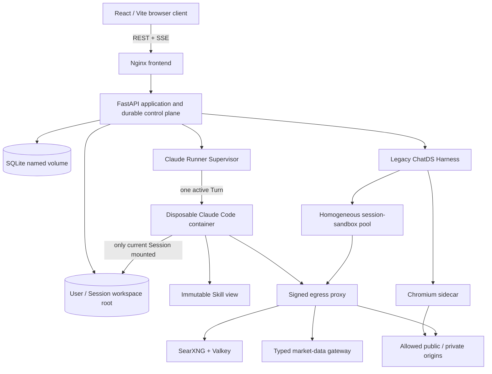

# ChatDS

ChatDS is a multi-user, session-workspace-isolated web application for running
long-lived agent tasks and portable Skills. It combines a React chat UI, a
durable FastAPI control plane, an isolated Claude Code execution engine, a
generic Skill compiler, controlled tools, persistent task state, and
content-addressed workspace artifacts.

> **Project status:** research and hobby software. The current deployment path
> is Linux + Docker Compose. The codebase has extensive deterministic tests,
> but it has not received an independent security audit and should not be
> exposed to untrusted users without additional hardening.

## 中文概览

ChatDS 是一个面向多用户、多 Session 的 Agent/Skill 执行平台。每个 Session 都有独立
workspace；长任务、子 Agent、工具调用、产物和终态会持久化；刷新页面或 SSE 断开不会把
浏览器连接当作工作流本身。默认执行内核是隔离容器中的 Claude Code，旧版 ChatDS
Harness 仍保留为历史兼容与回滚路径。

项目强调通用 Skill 执行，而不是为某个具体 Skill 写特判：Skill 的指令、资源、工作流、
能力、证据和产物合同先被编译为有界的运行时权威，再由收据、artifact 校验和唯一持久终态
判定是否完成。

## What is included

- Multi-user authentication and conversation management.
- One durable workspace per user/session, with authenticated upload, edit,
  preview, and download operations.
- SSE streaming backed by persistent AgentRun, task, tool, artifact, and
  terminal-event records.
- A default `ClaudeCodeEngine` that runs each active Turn in a disposable,
  resource-limited container mounted to exactly one Session workspace.
- A retained Legacy Harness engine for history/rollback. New Legacy runs are
  disabled by default.
- Portable Skill ZIP upload and installation, immutable Skill views,
  dependency/resource closure, structured workflow compilation, delegated
  workers, fan-in, evidence gates, and artifact contracts.
- Session-scoped Bash, Python, Node.js, Playwright, Selenium, and Chromium
  execution through a homogeneous sandbox pool.
- MCP, controlled web search through SearXNG, a typed market-data gateway,
  browser automation, file tools, persistent process tools, and durable
  schedules.
- Content-addressed image attachments and model capability checks for vision
  Turns.
- Signed, budgeted network egress with exact private-origin authority and an
  optional public HTTP(S) read profile.
- Frontend reconciliation for detached/background work, scheduled reports,
  reconnects, and safe application-version refreshes.

## Architecture



The control path is deliberately separated from the execution path:

1. The Backend authenticates the user, freezes the Conversation settings and
   Skill selection, creates durable run state, and owns the final application
   commit.
2. The selected engine compiles the current capability and artifact contract.
3. Model-authored work runs in a bounded Session execution environment.
4. Machine-owned receipts, files, child terminals, and controller effects are
   validated before one authoritative terminal is persisted.
5. The browser projects durable state; it is not the owner of the running task.

The intended workflow order is monotonic:

```text
compile/bind -> conditional authority -> mandatory receipts -> optional retrieval
-> synthesis -> fan-in -> artifact validation -> one durable terminal
```

## Isolation and security model

ChatDS uses several independent boundaries:

- The Backend derives a workspace from the authenticated user and Session.
  Path traversal, symlinks, special files, cross-Session paths, and unsafe
  archive members are rejected at file boundaries.
- Each Claude Turn receives only the current Session workspace, its run state,
  an immutable Skill view, and controller-owned sockets. It does not receive
  the Docker socket or an application network.
- Turn containers and the reusable session-sandbox pool use
  `network_mode: none`. Network access is relayed through a signed proxy policy.
- Private destinations require an exact deployment allowlist plus per-run
  authority. Public-read mode permits only bounded `GET`/`HEAD` on ports 80/443,
  strips caller credentials and request bodies, and rejects private/reserved
  address classes unless explicitly authorized.
- Workspace mutation locks live on a host-local Docker volume, not on the NFS
  workspace filesystem.
- Skill and artifact identities are content-addressed. Control-plane facts come
  from typed receipts and durable state, not assistant prose.

These controls reduce risk; they do **not** prove zero data exfiltration. A URL,
query string, DNS request, or an authorized model-provider request can itself
carry information. The Claude Supervisor is a trusted component with access to
the Docker socket, so deployment host security remains part of the threat
model.

Do not place secrets in a Session workspace, Skill package, prompt, generated
script, or Git history. Provider credentials belong only in the permission-
restricted deployment `.env` or an external secret manager.

## Prerequisites

- Linux x86-64 with a recent Docker Engine and Docker Compose plugin.
- Git, Python 3.12+, and Node.js 20+ for host-side development/tests.
- Outbound access during the initial image build for pinned base images,
  Python/npm dependencies, SearXNG, and the pinned Claude Code package.
- At least one configured model endpoint compatible with the checked-in model
  catalog and, for `ClaudeCodeEngine`, its provider profile.
- Sufficient disk and memory for browser/runtime images and workspace data.

The default Compose ceilings are intentionally sized for large agent jobs: four
3 GiB sandbox slots, a 2 GiB browser, and up to four concurrent 6 GiB Claude
Turn containers. These are limits rather than reservations, but a fully loaded
deployment can approach 40 GiB. Reduce slot count/concurrency/resource limits
for a smaller workstation.

## Quick start with Docker Compose

### 1. Clone and create local state directories

```bash
git clone https://github.com/feng4251/chat_ds.git
cd chat_ds
cp .env.example .env
mkdir -p data harness/data/memories workspace
chmod 700 data harness/data/memories workspace
```

The three storage roots must be absolute host paths because the Supervisor
creates disposable Turn containers through the Docker API. The following
one-time initializer replaces path placeholders and generates four independent
secrets without printing them:

```bash
python - <<'PY'
from pathlib import Path
import secrets

root = Path.cwd().resolve()
env_path = root / ".env"
text = env_path.read_text(encoding="utf-8")
replacements = {
    "CHATDS_DATA_ROOT": str(root / "data"),
    "CHATDS_MEMORY_ROOT": str(root / "harness" / "data" / "memories"),
    "CHATDS_WORKSPACE_ROOT": str(root / "workspace"),
    "SECRET_KEY": secrets.token_urlsafe(48),
    "INTERNAL_API_TOKEN": secrets.token_urlsafe(48),
    "EXECUTOR_V2_AUTH_TOKEN": secrets.token_urlsafe(48),
    "SEARXNG_SECRET": secrets.token_urlsafe(48),
}
lines = []
for line in text.splitlines():
    key = line.split("=", 1)[0] if "=" in line and not line.startswith("#") else ""
    lines.append(f"{key}={replacements[key]}" if key in replacements else line)
env_path.write_text("\n".join(lines) + "\n", encoding="utf-8")
PY
chmod 600 .env
```

### 2. Configure a model provider

Edit `.env` and configure at least one provider route. The checked-in default
Conversation model uses the `shaiengine` profile, so that profile requires:

```dotenv
SHAIENGINE_BASE_URL=https://your-provider.example/v1
SHAIENGINE_API_KEY=replace-with-your-provider-key
```

The repository also contains deployment-specific profiles for three local
OpenAI-compatible endpoints. Override these variables to use them:

```dotenv
DEEPSEEK_PRO_BASE_URL=http://your-glm-host:1025/v1
DEEPSEEK_PRO_URL=http://your-glm-host:1025/v1
LOCAL_DEEPSEEK_V4_FLASH_BASE_URL=http://your-deepseek-host:1025/v1
LOCAL_DEEPSEEK_V4_FLASH_URL=http://your-deepseek-host:1025/v1
QWEN3_5_BASE_URL=http://your-qwen-host:1025/v1
QWEN3_5_URL=http://your-qwen-host:1025/v1
```

For private/LAN model endpoints, also set
`CLAUDE_PROVIDER_PRIVATE_ORIGIN_ALLOWLIST` to the exact scheme/host/port origins
and add the resolved address ranges to `SKILL_EGRESS_PRIVATE_CIDR_ALLOWLIST`.
An endpoint in the model catalog is not, by itself, network authority.

The current Claude adapter uses an Anthropic Messages-compatible `/v1/messages`
surface even when the ordinary Backend catalog describes the same provider as
OpenAI-compatible. Verify both the model name and the protocol exposed by your
provider. Provider profiles are defined in `docker-compose.yml`; model metadata
and UI capabilities are defined in `backend/routers/chat_router.py`.

### 3. Start the full stack

```bash
docker compose --profile claude-code --profile local-search up -d --build
docker compose ps
curl --fail http://127.0.0.1:5173/api/health
```

Open <http://127.0.0.1:5173>, register the first user, and create a Conversation.
New Conversations use `ClaudeCodeEngine` by default.

The first build is large because the unified sandbox includes Python, Node.js,
Playwright, Selenium, Chromium, document/report libraries, and the pinned
Claude Code runtime.

### 4. Stop without deleting data

```bash
docker compose --profile claude-code --profile local-search down
```

Do not add `-v` unless you intentionally want to delete the database, runner
state, search state, proxy trust material, and local lock plane.

## Compose profiles and services

| Component | Purpose |
|---|---|
| `frontend` | Nginx-served React SPA and `/api`/SSE reverse proxy |
| `backend` | Authentication, Conversations, durable runs, Skills, files, schedules |
| `claude-runner-supervisor` | Trusted admission, container lifecycle, checkpoints, terminal ledger |
| `claude-runner-image` | Pins the disposable Claude Turn image in the deployment |
| `harness` | Retained generic Legacy Harness and shared capability services |
| `executor` ... `executor-4` | Homogeneous session-sandbox slots |
| `browser` | Isolated Chromium sidecar for browser actions |
| `skill-egress-proxy` | Signed destination, method, TLS, and budget enforcement |
| `searxng` / `searxng-valkey` | Optional `local-search` metasearch profile |
| `market-data-gateway` | Strict typed read-only quote broker |

`claude-code` enables the default engine services. `local-search` enables the
bundled SearXNG/Valkey pair. If local search is disabled, point
`SEARXNG_BASE_URL` and `CLAUDE_WEB_SEARCH_URL` at an existing compatible service.

## Models and vision

Model configuration has two related layers:

1. The Backend model catalog controls user-visible IDs, context window,
   `max_tokens`, thinking controls, and capabilities such as `vision`.
2. Claude provider profiles bind an exact API base URL, credential environment
   variable, wire model, and context window for isolated Turns.

Keep the two layers consistent. Runtime `/v1/models` metadata may refine model
capacity, but it does not automatically prove vision or tool compatibility.

Image input is accepted only when the selected catalog entry has
`is_multimodal: true`. Valid images are decoded and verified by the Backend,
published as content-addressed read-only Session attachments, revalidated by
the Supervisor, and mounted into the Turn. Selecting a text-only model for a
Turn with an image intentionally returns HTTP 400 before creating an AgentRun.

## Skills

Skills are uploaded as ZIP archives from the UI or authenticated API. A package
must contain a `SKILL.md`; it may also contain referenced instructions,
resources, scripts, workflow declarations, runtime metadata, and MCP
configuration. A bundle can expose one primary Skill and supporting Skills
without presenting every supporting member as an independent top-level choice.

At run time ChatDS:

1. Freezes the user/session-authorized package and resource digests.
2. Selects a relevant Skill from its name/description and the current request.
3. Compiles explicit workflow, capability, evidence, and artifact declarations.
4. Intersects child authority with parent authority before dispatch.
5. Requires machine receipts for mandatory tools/evidence and validates final
   files before committing success.

Installed Skills are not forced onto unrelated questions. Ordinary questions
can use general chat/search/tool capabilities without invoking an irrelevant
Skill. Conversely, an installed Skill cannot grant itself arbitrary host file,
network, package-install, or Docker access.

Runtime dependency installation is intentionally disabled. Declare required
Python/Node/command capabilities so preflight can fail before model work starts;
extend and rebuild the immutable sandbox image when a generally useful runtime
dependency is missing.

## Workspaces, attachments, and artifacts

The host `CHATDS_WORKSPACE_ROOT` contains per-user/per-Session trees. Inside a
Session, the user and agent can create ordinary files, while controller-owned
areas track input attachments, debug records, results, and execution state.

- Uploaded and generated regular files can be downloaded from the Workspace UI.
- Image attachments are content-addressed and mounted read-only for the Turn.
- Artifact records include path, digest, size, source, and run association.
- Multi-file writes use staging, compare-and-swap checks, and the shared local
  mutation-lock plane.
- Deleting a Conversation requires durable deletion intent; an apparently
  orphaned workspace is retained when authority cannot be proved.

Do not manually copy one Session tree over another. Use the authenticated fork
operation so messages, settings, Skills, workspace state, and ownership fences
are projected consistently.

## Long runs, reconnects, and schedules

An accepted Turn is a durable background operation. The SSE connection is an
observer: disconnecting or refreshing detaches the client but does not cancel
the root task. On reconnect, the frontend reconciles messages, run cards, and
terminal state from the Backend.

The default absolute ceilings are four hours for a progressing model stream,
five hours for the outer Backend stream, and six hours for delegated workflow
batches. Idle/progress leases and controller cleanup have independent bounds.
Tune these values together; an outer transport timeout must never be shorter
than the inner owner that must persist terminal state.

Durable schedules are owned by the Backend scheduler, not by a disposable
Claude CLI process. Schedule requests are validated at the tool boundary and
again when their controller-owned effect is committed. Use `max_runs` for a
bounded number of reports and add an expiry only when the user gave a real time
boundary.

## Development and tests

Create a Python 3.12 virtual environment and install the component
requirements, or run the suites inside suitable containers. Typical commands
from the repository root are:

```bash
python -m pip install pytest \
  -r backend/requirements.txt \
  -r harness/requirements.txt \
  -r claude_runner/requirements.txt
PYTHONPATH=backend python -m pytest -q backend/tests

cd harness
PYTHONPATH=..:. python -m pytest -q
cd ..

PYTHONPATH=.:harness:backend:executor/browser_runtime \
  python -m unittest discover -v -s claude_runner/tests

cd frontend
npm ci
npm test
npm run build
npm run lint
```

Some sandbox, browser, image-conformance, namespace, and Docker lifecycle tests
require Linux, Docker, the built runtime images, or elevated host capabilities.
Run the targeted unit suites first, then validate the exact final container
entrypoints and Compose topology before deployment.

Useful static checks include:

```bash
python -m compileall -q backend harness claude_runner executor \
  browser_sidecar skill_egress_proxy market_data_gateway
docker compose --profile claude-code --profile local-search config >/dev/null
git diff --check
```

When fixing a defect exposed by a complex Skill, first express it as a generic
compiler, workflow, capability, sandbox, evidence, artifact, recovery, or
lifecycle invariant. Add a synthetic regression and a renamed/cross-domain
holdout; do not add package IDs, domain terms, fixed worker counts, filenames,
or Session IDs to production policy.

## Operations

Check service state and follow the main control paths:

```bash
docker compose ps
docker compose logs -f frontend backend claude-runner-supervisor harness
curl --fail http://127.0.0.1:5173/api/health
```

For upgrades:

1. Stop accepting new work and wait for active AgentRuns, schedules, and
   disposable Turn containers to reach terminal state.
2. Back up the SQLite volume using SQLite's online backup API, or stop the
   Backend before taking a volume snapshot.
3. Build immutable candidate images from a clean Git tree.
4. Run migrations, health checks, container-entrypoint smoke tests, and a
   controlled test Conversation.
5. Keep the previous image tags and database snapshot until the new cohort is
   stable.

Never treat `docker compose down -v`, broad image pruning, or workspace deletion
as an ordinary upgrade step.

## Troubleshooting

### `/api/health` returns 503

Inspect both Backend and dependent-service logs. Health includes cross-service
storage identity and may fail closed when the Backend and Harness do not see the
same `CHATDS_DATA_ROOT`, the local mutation-lock volume is missing, or the
Claude Supervisor has not admitted its runtime image.

### A Claude Turn fails before model output

Check `claude-runner-supervisor` first. Common bootstrap causes are an absent
Turn image, invalid provider profile, provider origin not authorized by the
egress policy, an unreadable Skill view, or an invalid workspace host root.
Runner bootstrap failures should end in a typed durable terminal rather than a
generic missing-stream message.

### Search or website access fails

Distinguish policy rejection from upstream failure. A
`request_url_not_allowed` result means the signed run policy did not authorize
that origin/method/path. HTTP 4xx/5xx, CAPTCHA, engine throttling, DNS/TLS errors,
and empty SearXNG results are external/upstream conditions. Private destinations
need exact origin and CIDR configuration; public-read mode does not grant private
or nonstandard-port access.

### The page shows old state after a background report

Confirm the browser loaded the current frontend build, then check the run-card
and message reconciliation requests. The durable database projection is
authoritative; a completed background run should not depend on keeping the
original SSE connection open.

### An image request is rejected

Choose a catalog model marked vision-capable. The Backend rejects unsupported
image Turns before AgentRun creation; changing context length does not turn a
text-only model into a vision model.

### A Skill is installed but not invoked

That can be correct when the current request is unrelated. For an applicable
request, inspect the immutable Skill selection, compiled workflow/capability
view, and AgentRun debug timeline together. A final frontend error string alone
is not enough to identify whether the cause is the Harness, Skill, provider,
network policy, or upstream service.

## Repository layout

```text
backend/               FastAPI API, database, engines, schedules, Skill/file control
frontend/              React/Vite application and Nginx configuration
harness/               Generic Legacy Harness, Skill compiler, tools, workflow runtime
claude_runner/          Claude Code Turn image, Supervisor, MCP adapters, durable ledger
executor/               Unified session-sandbox runtime and process protocol
browser_sidecar/        Isolated Chromium/CDP service
skill_egress_proxy/     Signed HTTP(S) policy proxy and budget ledger
market_data_gateway/    Typed fixed-upstream market quote broker
searxng/                Local SearXNG configuration
docker-compose.yml      Full deployment topology and optional profiles
```

Runtime data, uploaded Skills, generated artifacts, secrets, local reference
repositories, and internal operational handoff files are intentionally not part
of the public Git tree.

## Contributing

Issues and pull requests are welcome. Please include:

- a minimal deterministic reproduction;
- the exact component and observable failure boundary;
- tests for the generic invariant, including a cross-domain or rename holdout
  when applicable;
- confirmation that no credentials, Session data, generated business artifacts,
  or third-party source were added;
- migration and rollback notes for durable-state changes.

Avoid fixture-specific Harness logic. Values explicitly declared by a Skill can
be compiled as data, but must not become hard-coded policy.

## License and third-party software

Original ChatDS contributions are provided under the
[PolyForm Noncommercial License 1.0.0](LICENSE). This is a source-available,
noncommercial license and is **not** an OSI-approved open-source license.

Third-party dependencies, container images, model runtimes, uploaded Skills,
datasets, and generated content remain under their own terms. In particular,
the Claude Code package installed while building the optional runner is not
relicensed by ChatDS. See [THIRD_PARTY_NOTICES.md](THIRD_PARTY_NOTICES.md).

## Disclaimer

ChatDS can produce medical, financial, regulatory, and other high-impact
content. Outputs may be incomplete or wrong and are not professional advice.
Users are responsible for source verification, legal/licensing compliance,
provider terms, network policy, and human review before relying on results.
